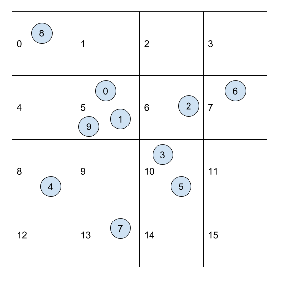
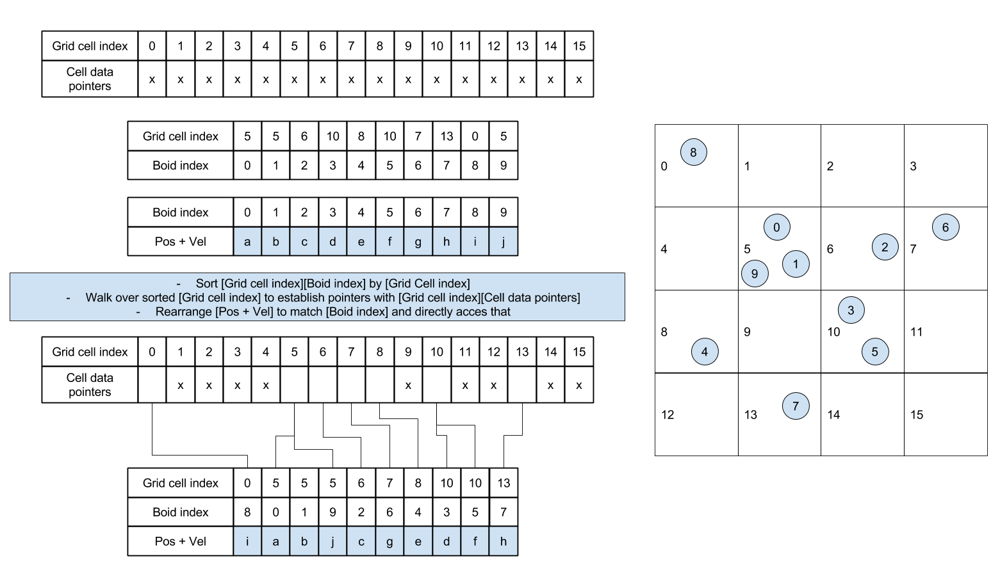

Here're my notes on [Project 1 - Flocking](https://github.com/CIS565-Fall-2022/Project1-CUDA-Flocking/blob/main/INSTRUCTION.md) as part of UPenn CIS 565: GPU Programming and Architecture. 

### @ Brief
The basic idea of boid flocking is to apply certain rules on the change of velocity of each boid based on the positions and velocities of its neighbors. Transitioning from CPU to GPU acceleration, it requires certain changes to ensure correct calculations. I'll explain the algorithm for CUDA parallelization that I learned from this course and the reasons behind applying algorithms different from CPU version. 

#### - Start with CPU
Implementing on CPU is straightforward, 
 - Brute-force: nested for loop along three axes. Time complexity O($n^2$)
 - A more work-efficient strategy: In order to improve computing efficiency, dividing the space into **uniform grid** and pre-assigning a grid cell index to each boid is a common approach to reduce the number of neighbor checking. Pre-processing the objects and map each of them to its grid cell so that in the simulation we only need to compute the boids in the relevant grid cells instead of checking all boids at every time step. 
 
 
 Now when we move on to CUDA parallelization, the project introduce a new algorithm: sorting by grid cell index.   

#### - Move on to GPU 

In case you're also wondering ...

**Q:**  From brute force to pre-processing boids with uniform grid on GPU, what is the advantage of **sorting by grid cell index** strategy? Why can't we use the same algorithm as on CPU? 

**A:**  (For demonstration purpose, suppose there're `N` boids. The space is divided into `M` grid cells.)

To implement the pre-processing, naturally, on **CPU** I'd allocate a  `gridCellIndexArrary` of size `N` to store the grid cell index of each boid, and a dynamic array `particleIndexArray` for each grid cell, then iterate through each boid and add its index to the corresponding grid cell's `particleIndexArray`. 

During flocking, for each boid we can obtain which cell it belongs to by `gridCellIndexArrary` and then the boids enclosed can be accessed by `particleIndexArray` in constant time.

Now we move on to **GPU**. The strategy above is no longer applicable. For the reasons 
1) There's no dynamic array on GPU. 
2) Race condition. 

Point 1 is straightward. Let me explain a little more on point 2. Suppose we parallelize pre-processing (i.e. assigning a grid cell index to each boid) on GPU, each thread is responsible for one boid to add its index to the corresponding grid cell's `particleIndexArray`. When two of the boids in the same cell grid are being added to the same `particleIndexArray` at the same time, the two corresponding threads might overwrite each other's results, leading to erroneous record. 

So we need to revise the pre-processing method to avoid 1) using dynamics array 2) letting multiple threads writing to shared memory. One of the viable approaches is by sorting. Same as on CPU, we first allocate a  `gridCellIndexArrary` of size `N` to store the grid cell index of each boid. Meanwhile, we also allocate a `particleIndexArray` of size `N` to store the boid cell index of each boid. Then **sorting by key** with `gridCellIndexArrary` as key and `particleIndexArray` as value, we can obtain the start and end boid indices of each grid cell at the junction of blocks of homogeneous values in sorted `gridCellIndexArrary`. Mapping the boid enclosed in those grid cells during flocking is similar to CPU version. 
